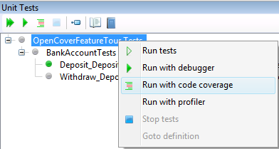
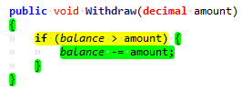
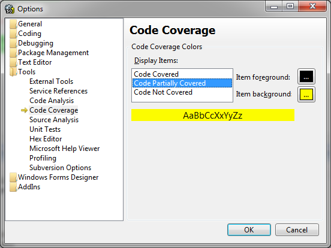

SharpDevelop has had support for code coverage for a while now thanks to PartCover and more recently thanks to [OpenCover](https://github.com/OpenCover/opencover). In SharpDevelop 5 an [external contributor](https://github.com/ddur) added support for showing branch coverage in the text editor. Branch coverage will show you whether all paths or branches through the code have been executed by your tests. So let us take a look at this in SharpDevelop 5.

## Branch Coverage

First let us start with an existing C# project that has some unit tests for a BankAccount class. The source code and associated project is available as a [.zip file](http://community.sharpdevelop.net/blogs/mattward/OpenCover/OpenCoverFeatureTour.zip) to download.

Our BankAccount class is shown below.

	public class BankAccount
	{
		decimal balance;
			
		public void Deposit(decimal amount)
		{
			balance += amount;
		}
		
		public decimal Balance {
			get { return balance; }
		}
		
		public void Withdraw(decimal amount)
		{
			// TODO.
		}
	}

Now we will write a unit test for the Withdraw method.

	[Test]
	public void Withdraw_Deposit20PoundsThenWithdraw5Pounds_BalanceIs15Pounds()
	{
		var account = new BankAccount();
		account.Deposit(20m);
			
		account.Withdraw(5m);
			
		Assert.AreEqual(15m, account.Balance);
	}

To get this test working we update the Withdraw method with the code shown below:

	public void Withdraw(decimal amount)
	{
		if (balance >= amount) {
			balance -= amount;
		}
	}

Notice that there is an if statement at the start of the Withdraw method to prevent the account from being overdrawn. Now in SharpDevelop 4, if you ran the unit tests with code coverage, the Withdraw method would show 100% statement coverage. However the unit tests currently do not execute the path through the code where the amount being withdrawn is greater than the current balance. In SharpDevelop 5 the new branch coverage feature allows you to see this code is not fully covered. In SharpDevelop 5, right click the unit tests and select Run with code coverage.

Now if you open the BankAccount class into the text editor you should see the following:

The code highlighted in yellow shows you that all possible branches through this code have not been executed. Once another unit test is added that tries to to withdraw an amount larger than the current balance then all the code in the BankAccount will be highlighted in green showing that all the branches are covered.

Finally the colour used to highlight the code in the partially covered branch can be configured by selecting Options from the Tools menu to open the Options dialog.

That is the end to this brief introduction to branch coverage in SharpDevelop 5.
