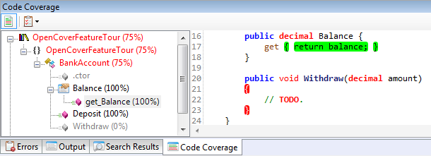
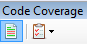
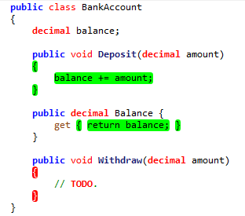

SharpDevelop 4.3 now has integrated support for [OpenCover](https://github.com/sawilde/opencover) thanks to [Lex Li](http://www.lextm.com/).

OpenCover is an open source [code coverage tool](http://en.wikipedia.org/wiki/Code_coverage) created by [Shaun Wilde](http://scubamunki.blogspot.co.uk/). It can be used to measure how much of your code is covered by your unit tests. OpenCover was created to fix the following problems in [PartCover](http://sourceforge.net/projects/partcover/), another open source code coverage tool.

* 64 bit support
* Memory usage
* Returning no coverage results

For a more detailed look into why OpenCover was created you should read Shaun Wilde's [OpenCover First Beta Release](http://scubamunki.blogspot.co.uk/2011/06/opencover-first-beta-release.html) post.

Back in 2006 SharpDevelop added support for NCover, then it switched to using PartCover a year later when NCover was turned into a commercial product. Now it supports and ships with OpenCover so let us take a tour of using OpenCover with SharpDevelop.

## OpenCover Feature Tour

First you should install [SharpDevelop 4.3](http://build.sharpdevelop.net/buildartefacts/). Version 4.3.0.8911 or above will have OpenCover support. Then you will need to use a project with unit tests or alternatively you can [download a zip file](http://community.sharpdevelop.net/blogs/mattward/OpenCover/OpenCoverFeatureTour.zip) which contains the set of projects created whilst writing this feature tour. Open your solution with SharpDevelop 4.3 and let us get started.

## Running Unit Tests with Code Coverage

To run the unit tests with code coverage open the **Unit Tests** window by selecting **Tools** - **Unit Tests** from the **View** menu.  Right click the project or tests that you want to check for code coverage and select **Run with code coverage**.

At the top of the **Unit Tests** window there is the run with code coverage toolbar button which can be also used to run code coverage for all the tests.

Another way to run the unit tests with code coverage is to right click in the text editor and select the **Run with code coverage** menu option.

The unit tests will then be run and OpenCover will profile your code. The output from OpenCover will be displayed in the **Output** window. Once OpenCover is finished the code coverage results will be displayed in the **Code Coverage** window.

## Code Coverage Results

The code coverage window will show you the percentage of code covered for each class, method and property. On the right hand side you can see the visit count information or if you select the **Show Source Code** option you can see the corresponding source code with covered code highlighted in green and uncovered code highlighted in red.

The Code Coverage window also allows you to enable or disable code coverage highlighting in the text editor. The top left button in the Code Coverage window is used to enable or disable code coverage highlighting in the text editor.

In the screenshot below the text editor has covered code in highlighted in green and uncovered code in highlighted in red.

## Filtering Code Coverage Results

By default OpenCover will show you code coverage for all your code including your tests. Typically you are not interested in code coverage for your unit tests. To exclude classes you can use a filter. The filters you can use are described on the [OpenCover wiki](https://github.com/sawilde/opencover/wiki/Usage). To specify a filter in your unit tests project select **Project Options** from the **Project** menu.  Then open the **Code Coverage** tab. Here you can specify an include or exclude filter. In the screenshot below all types in the **OpenCoverageFeatureTour.Tests** assembly will be excluded.

## 64 bit or 32 bit

On Windows x64 if your test project is set to target a 32 bit processor then the 32 bit version of NUnit will be used to run your unit tests. If it is set to **Any CPU** or a 64 bit processor then NUnit will run as a 64 bit process as OpenCover profiles your code.

## Code Coverage Options

The colours used to highlight code coverage in the text editor and Code Coverage window can be configured in the Options dialog. From the **Tools** menu select **Options**. Then expand the **Tools** category and select **Code Coverage**.

That ends the tour of using OpenCover with SharpDevelop.
