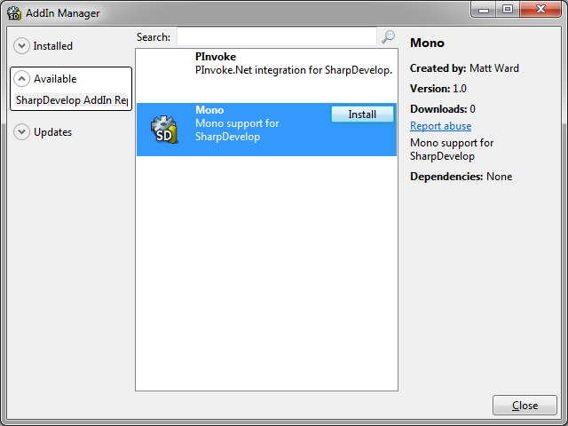

# Intro

The SharpDevelop team recently announced a new [Addin Manager](http://community.sharpdevelop.net/blogs/andreasweizel/archive/2013/06/10/introducing-the-new-addin-manager-in-sharpdevelop-5.aspx) for SharpDevelop 5 and an [online gallery for addins](http://www.myget.org/gallery/sharpdevelop) that is hosted on MyGet.

SharpDevelop has been extensible through addins since it was first created but it has never before had an online gallery. The majority of IDEs have an online gallery that can be used to find and install extensions. WebMatrix is one example that provides extensions through from its own [NuGet feed](http://extensions.webmatrix.com/) just like SharpDevelop.

Addins for SharpDevelop 5 can now be published as NuGet packages to a MyGet gallery. NuGet gives SharpDevelop all the benefits of versioning and updating addins whilst MyGet provides a central place where SharpDevelop addins can be found and installed from.

SharpDevelop's addin gallery on MyGet is a community gallery which is open to anyone to publish their own addins.

# Background

About a year ago there was a discussion on the SharpDevelop mailing list about having an online source of addins for SharpDevelop. [Andreas Weizel](http://community.sharpdevelop.net/blogs/andreasweizel) had started work on a way to obtain addIns from an online source but at the time it was not based on NuGet. [Christoph Wille](http://community.sharpdevelop.net/blogs/christophwille/), Project Manager for SharpDevelop, suggested looking at re-using the NuGet gallery for hosting the packages and using NuGet to download and install addins. One idea was to put the addins on the main NuGet.org feed and add a special tag to them to distinguish them however it made more sense for SharpDevelop to have its own gallery. Rather than setting up a server and hosting a NuGet gallery ourselves it was quicker and easier to use MyGet.

Now let us take a look at how you can make your own addins available for SharpDevelop 5. If you have published a NuGet package to the gallery hosted on NuGet.org then the following procedure will be very familiar.

# Publishing an Addin with MyGet

 Here we will look at the steps taken to publish an addin that provides support for compiling against Mono. The [source code](https://github.com/icsharpcode/SharpDevelop/tree/newNR/samples/Mono) for this sample addin is available on GitHub. The first step is to compile the addin. With the Mono addin compiled we need to create a [.nuspec file](http://docs.nuget.org/docs/reference/nuspec-reference) that will be used to generate a NuGet package containing all the files needed for the addin:

		<?xml version="1.0"?>
		<package xmlns:xsd="http://www.w3.org/2001/XMLSchema" xmlns:xsi="http://www.w3.org/2001/XMLSchema-instance">
			<metadata xmlns="http://schemas.microsoft.com/packaging/2010/07/nuspec.xsd">
				<id>Mono</id>
				<version>1.0</version>
				<authors>Matt Ward</authors>
				<owners>SharpDevelop</owners>
				<requireLicenseAcceptance>false</requireLicenseAcceptance>
				<description>Mono support for SharpDevelop</description>
				<iconUrl>http://community.sharpdevelop.net/blogs/mattward/SharpDevelop.png</iconUrl>
				
Mono support for SharpDevelop

				<releaseNotes></releaseNotes>
				<language>en-US</language>
				<tags>mono</tags>
			</metadata>
			<files>
				<file src="..\..\..\AddIns\Samples\Mono.Addin\**\*.*" target="" />
			</files>
		</package>

In the above .nuspec file we are adding all the addin files, including any subdirectories, by using the double wildcard ** so we do not have to explicitly specify every file. SharpDevelop requires the main addin assembly and its associated .addin configuration file to be in the root of the NuGet package. This is why the target for these files defined in the .nuspec file has been left empty.

Now we can generate the NuGet package by running NuGet.exe from the command line:

    nuget pack mono.nuspec
    
On running this command you will see a "Assembly outside lib folder" warning which can safely be ignored since we are not going to be adding this NuGet package to a .NET project. We have now generated a Mono.1.0.nupkg file which is what we will publish to the MyGet gallery.

To publish to MyGet you will need your MyGet account's personal API key. Your API key can be found under Account Settings in the Security section. Copy your API key and in the following command line replace the **Your-API-Key** with your key:

    nuget push Mono.1.0.nupkg Your-API-Key -Source https://www.myget.org/F/sharpdevelop/api/v2/package

Running the above command will publish the Mono addin to MyGet. Now anybody using SharpDevelop 5 can install the Mono addin by selecting AddIn Manager from the Tools menu.

You can see the list of available addins by clicking the Available section of the dialog. To install the Mono Addin select it and click the Install button. The addin will be available after SharpDevelop is restarted.

# Bio

Matt Ward is developer at [Pebble Code](http://pebblecode.com/). In his spare time he works on SharpDevelop, which he has been involved with since 2004, and more recently has been working on a [NuGet addin for MonoDevelop and Xamarin Studio](https://github.com/mrward/monodevelop-nuget-addin).

Blog: [community.sharpdevelop.net/blogs/mattward](http://community.sharpdevelop.net/blogs/mattward)
Twitter: [@sharpdevelop](http://twitter.com/sharpdevelop)

# SharpDevelop Bio

[SharpDevelop](http://www.icsharpcode.net/OpenSource/SD/) is an Integrated Development Environment (IDE) for .NET applications created back in 2000 by [Mike Krüger](http://mikemdblog.blogspot.co.uk/). It supports the development of applications written in C#, Visual Basic.NET, F# and IronPython. It is [open source](http://github.com/icsharpcode/sharpdevelop) and written in C#. 