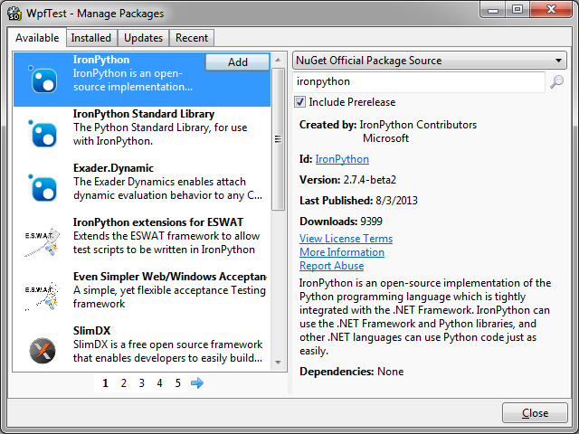
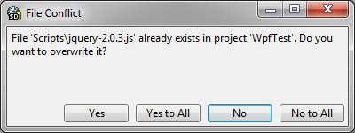

SharpDevelop 4.3 has been updated to use [NuGet 2.6](http://docs.nuget.org/docs/release-notes/nuget-2.6) and also includes some new features that were missing when compared with using NuGet in Visual Studio.

## New Features

* Support for prerelease packages.
* Support for packages using [XML Document Transformations](https://xdt.codeplex.com/) (XDTs).
* File conflict dialog is displayed when installing a package that is trying to add files that already exist in the project.
* Support for packages that include MSBuild targets and properties files.
* Support for accessing authenticated NuGet package feeds.
* Update All button added to Manage Packages dialog so all packages can be updated in a project or solution in one step.

Now let us take a look at some of these new features in more detail.

### Prerelease packages

The Manage Packages dialog now has an **Include Prerelease** check box which when checked will allow you to search for and install prerelease packages. In the screenshot below the IronPython prerelease package has been selected.

### XML Document Transformations

[NuGet 2.6](http://docs.nuget.org/docs/release-notes/nuget-2.6) added support for XDTs. This allows complex transformations of a project's app.config or web.config when a NuGet package is installed or uninstalled. In the NuGet package you can add XDTs by using naming your file after one or more of the following:

* web.config.install.xdt
* web.config.uninstall.xdt
* app.config.uninstall.xdt
* app.config.uninstall.xdt

These files should target the *content* folder so in your .nuspec file you should have something similar to:

	<files>
		<file src="MyTransforms\*.xdt" target="content" />
	</files>

Further information on XDTs is available on the [MSDN](http://msdn.microsoft.com/en-us/library/dd465326.aspx).

### Authenticated NuGet Feeds

You can now browse and install packages from authenticated NuGet feeds that use basic authentication and Windows authentication. Currently there is no login dialog but you can add your username and password to your NuGet.config file.

To add your username and password to your NuGet.config file you will need to use NuGet.exe and run the following command, replacing the feed name, username and password with the correct values.

    NuGet.exe sources update -name FeedName -username user -password pass

After adding your username and password to NuGet.config you will need to restart SharpDevelop since the information held in the NuGet.config file is cached.

### File Conflict Dialog

NuGet 2.6 will now check for existing files in your project that match those being installed by a package. If there is a match then a dialog will be displayed so you can decide whether to overwrite the files.

