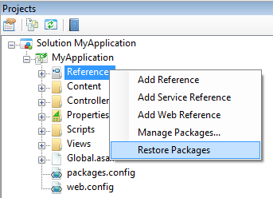
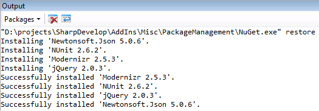

SharpDevelop 4.3.3 has been updated to use [NuGet 2.7](http://docs.nuget.org/docs/release-notes/nuget-2.7) and now has support for restoring NuGet packages.

## Restoring NuGet Packages

To restore NuGet packages for your solution, from the **Projects** window right click the solution, project or References, and select **Restore NuGet Packages**.

This will run NuGet.exe and uses the new **restore** argument that has been added to NuGet 2.7. The full command line will be similar to the following:

    NuGet.exe restore YourSolution.sln

The output from this command will be shown in the **Output** window.  In the screenshot below you can see jQuery, Json.NET, Modernizr and NUnit being restored.

